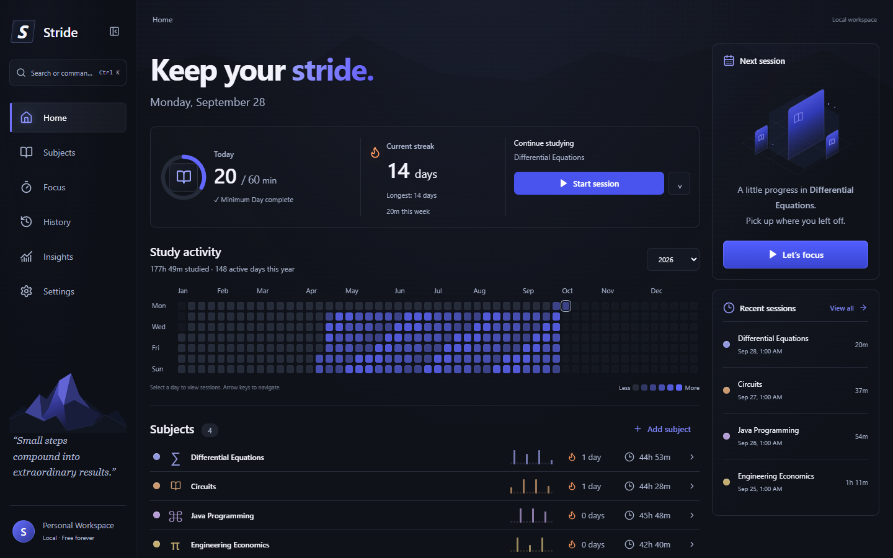

# Stride

**Build consistency, one session at a time.**

Stride is a local-first study tracker for Windows and the web, built around subjects, real study sessions, streaks, and GitHub-style contribution heatmaps. No account is required.

## Windows app — no server required

Download the **Stride-Windows-x64** artifact from the latest successful [Windows build](https://github.com/NotThatBoii/stride/actions/workflows/windows.yml). Sign in to GitHub, extract the ZIP, and run `Stride_0.3.0_x64-setup.exe` in `bundle/nsis`. The installer adds Stride to Start. You can also run the included `stride.exe` directly. Windows 10/11 x64 and WebView2 are required; the installer downloads WebView2 if missing. Builds are currently unsigned.

Once installed, open **Stride** from Start. Normal use needs no terminal, Node.js, local server, or internet connection. The application files are embedded in the executable.

To move existing history: open the web version once, choose **Settings → Export JSON**, then **Settings → Import JSON** in the Windows app. Web and desktop have separate workspaces. Imports validate the file and ask before replacing data. Keep the export as a backup.

### Build the Windows app

Install the [Tauri Windows prerequisites](https://v2.tauri.app/start/prerequisites/): stable Rust, Visual Studio C++ Build Tools, a Windows SDK, and WebView2.

```powershell
npm.cmd ci --legacy-peer-deps
npm.cmd run desktop:build
```

The installer is written to `src-tauri/target/release/bundle/nsis/`; the standalone executable is `src-tauri/target/release/stride.exe`. `npm.cmd run desktop:dev` starts the development server automatically. Only development needs a server. GitHub Actions builds an installer for source changes on `main` and retains artifacts for 30 days.

## Screenshots



[Subjects](docs/screenshots/subjects.png) · [Subject activity](docs/screenshots/subject.png) · [Focus](docs/screenshots/focus-active.png) · [History](docs/screenshots/history.png) · [Insights](docs/screenshots/insights.png) · [Settings](docs/screenshots/settings.png) · [Light theme](docs/screenshots/narrow-light.png)

Populated screenshots use an isolated test fixture. Stride never adds sample study records to your workspace. [A fresh workspace](docs/screenshots/home-empty.png) starts with an empty activity graph.

## Features

- Create, rename, color, archive, restore, and delete subjects.
- Stopwatch and countdown sessions with pause/resume, titles, notes, and recovery after reopening.
- Overall and subject-specific heatmaps with intensity levels, year selection, tooltips, selected days, and keyboard navigation.
- Configurable Minimum Day, current and longest streaks, and daily progress.
- Date-grouped history with subject/date filters, editing, deletion, and incremental loading.
- Weekly comparisons, monthly totals, subject distribution, and eight-week trends.
- Neutral dark/light themes, compact subject rows, and a distraction-reduced active timer.
- Three-step onboarding, quick actions (`Ctrl/Cmd + K`), and recent-subject selection.
- IndexedDB persistence, automatic migration from the earlier browser storage, JSON export, and validated JSON restore.
- Optional browser notifications when a countdown ends while Stride is open.

## Tech stack

React 19 · TypeScript (strict) · Vite · Tauri 2 / Rust · Dexie / IndexedDB · Zod · Lucide · CSS.

The Windows app uses the system WebView2 runtime in a native Tauri window; the web version runs in ordinary browsers. Both share the study logic and interface. Native file dialogs and Windows notifications are enabled in the desktop app.

## Getting started

Use Node.js 22.12+ and npm.

```sh
git clone https://github.com/NotThatBoii/stride.git
cd stride
npm ci --legacy-peer-deps
npm run dev
```

Open **http://127.0.0.1:1420**. Keep using the same browser and address: browser data belongs to its origin. `localhost`, `127.0.0.1`, and a hosted URL have separate workspaces. Export/import transfers your data between them.

## Development

```sh
npm test          # Analytics, calendar accounting, timers, storage, validation
npm run test:e2e  # Browser workflows, restart persistence, and screen checks
npm run build     # Strict TypeScript + production build
npm run preview   # Serve dist locally
npm run format    # Format source, tests, and configuration
```

Playwright tests use installed Microsoft Edge and fresh browser contexts. The restart test uses a temporary profile under ignored `test-results/`. Tests do not modify your actual browser workspace. Windows GitHub Actions run the same checks.

Web production output is generated in `dist/` and can be served by a static web host. The web version has no service worker, so opening/reloading it requires its files to be reachable. The desktop build embeds those files and opens offline.

## Data storage and safety

The IndexedDB database `stride` contains versioned tables for subjects, sessions, daily allocations, settings, timer recovery, and migration metadata. Windows stores it in Stride's persistent WebView2 profile under the user's local app data, normally `%LOCALAPPDATA%\com.philippaglinawan.stride`. Browser data belongs to the site's origin. Transactions keep session records and daily totals consistent. Streaks and insights are calculated from records. The desktop app uses single-instance handling to avoid competing windows.

The previous `stride-browser-preview-v1` localStorage dataset is validated and migrated once, transactionally. The original copy remains untouched as a migration backup; it is no longer updated. Invalid old data produces an error rather than silently resetting the workspace.

**Settings → Export JSON** downloads the complete workspace. **Import JSON** validates the format/version, field types, IDs, references, timestamps, timer intervals, and daily totals before asking to replace the current workspace. Restoration is atomic, and restored timers are paused at export time. Import is disabled while a session is active. Export your current data before replacing it.

IndexedDB survives refreshes, browser restarts, and reopening the same origin. Clearing site data, browser profile loss, private browsing, or browser eviction can still remove it. Keep periodic exports. There is no cloud backup or synchronization.

### Session and streak rules

- Default Minimum Day: 20 minutes. Overall streaks combine **active** subjects; each subject requires the minimum within that subject.
- An incomplete today keeps yesterday's streak alive until midnight. A missed day restarts the current streak without removing past activity.
- Study intervals split at local calendar midnight and exclude pauses. Recorded day keys remain stable if you travel between timezones.
- An unpaused stopwatch counts elapsed wall time while the app is closed. Countdown recovery caps time at the target. Closed browsers do not send scheduled notifications.
- Text-only session edits preserve daily allocations. Time edits redistribute that session continuously from the selected start.
- Archiving excludes the subject from overall totals, but preserves its history and dedicated detail page. Restoring includes it again.

## Project structure

```text
src/
  components/   Heatmap, subject rows, session rows, dialogs, onboarding
  pages/        Home, subjects, focus, history, insights, settings
  lib/          IndexedDB, backup validation, date/streak analytics, timer logic
  models.ts     Domain types
  state.tsx     React context, observable persistence, guarded mutations
  styles.css    Neutral themes, layout, typography, responsive behavior
tests/e2e/     Isolated workflows, persistence, and visual checks
docs/         Screenshots and architecture notes
```

Navigation remains the existing React view-state implementation. Domain types, timer accounting, and analytics were preserved during the redesign.

## Roadmap

- Installable web app and offline application-shell caching.
- Optional encrypted backup and synchronization.
- Per-subject goals and additional keyboard commands.
- More browsers and accessibility checks in CI.

## License

MIT licensed. The original [LICENSE](LICENSE) is preserved unchanged.

Copyright © 2026 Philip Paglinawan.
