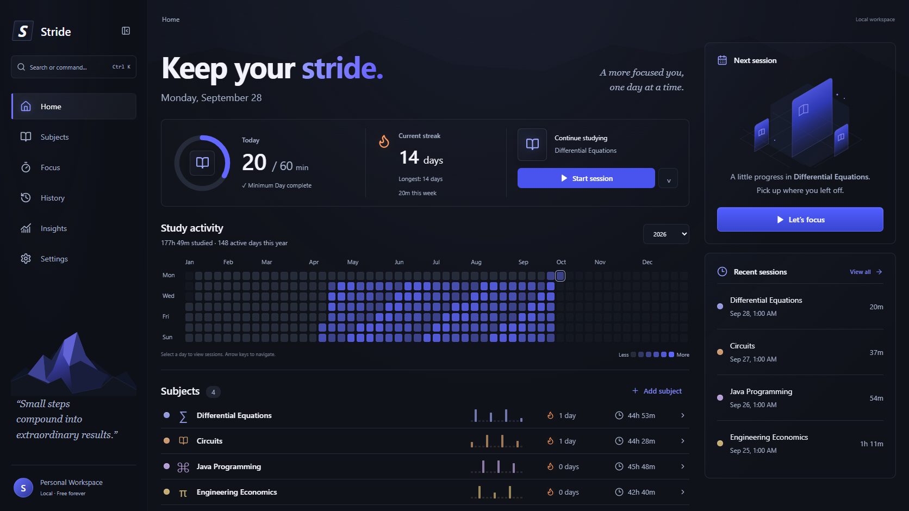

# Stride

**Build consistency, one session at a time.**

Stride is a study tracker for Windows and the web, built around subjects, real study sessions, streaks, and GitHub-style contribution heatmaps. A Supabase email/password account is required to enter the app. Study data saves immediately to an account-scoped IndexedDB workspace and synchronizes completed history and shared study preferences across signed-in devices. Conflicting versions are preserved for review.

Phase 6 adds a static offline PWA shell, explicit update controls, a Recovery and sync issues area, mobile fixes, and measured large-history hardening. See [the Phase 6 release report](docs/PHASE_6_HARDENING.md) for exact local/CI/native/hosted results and remaining release gates. Its retention policy is a proposal; history and operation receipts are not automatically pruned.

## Windows app — no local server required

**[Download Stride for Windows](https://github.com/NotThatBoii/stride/releases/latest)** — choose the Windows setup executable under Assets, run it, and open Stride from Start. Share that release link with friends; no GitHub account is needed to download from this public repository. Published releases may predate the account-required entry flow described here.

Windows 10/11 x64 only. The installer downloads WebView2 if missing (internet required for that initial download). A portable ZIP and SHA-256 checksums are available on the same release. Portable means no installation; study data still lives in your Windows user profile. Builds are currently unsigned.

Once installed, open **Stride** from Start. Normal use needs no terminal, Node.js, or local server. The application files are embedded in the executable. Signing in requires a connection to Supabase. An existing unexpired session can restore through the official Supabase client while offline; a signed-out device or a session that cannot refresh stays at the authentication screen.

Sign into the same account to synchronize completed study history between web and desktop. Each app keeps its own local cache, appearance, notification settings, and active timer. **Settings → Cloud synchronization** shows pending changes, conflicts, last sync, and **Sync now**.

JSON backups remain available through **Settings → Export JSON** and **Import JSON**. Imports validate and stage the file, require a backup download, reconcile with cloud history, and add records without replacing unrelated account data. Earlier anonymous history offers an explicit **Import into my account** or **Keep it stored for later** choice; its original source is retained. See [Phase 5 synchronization and recovery](docs/PHASE_5_SYNC.md).

### Build the Windows app

Install the [Tauri Windows prerequisites](https://v2.tauri.app/start/prerequisites/): stable Rust, Visual Studio C++ Build Tools, a Windows SDK, and WebView2.

The Windows build wrapper supplies the intended already-public project URL/publishable key from `config/supabase-public.json`, or validates the matching public environment variables described in [authentication setup](docs/PHASE_4_AUTH.md#local-setup). It rejects private keys/foreign projects and checks the embedded frontend before publishing a build artifact. The narrow Tauri CSP is preserved.

```powershell
npm.cmd ci --legacy-peer-deps
npm.cmd run desktop:build
```

The installer is written to `src-tauri/target/release/bundle/nsis/`; the standalone executable is `src-tauri/target/release/stride.exe`. `npm.cmd run desktop:dev` starts the development server automatically. Only development needs a server. GitHub Actions builds an installer for source changes on `main` and retains development artifacts for 30 days. Pushing a version tag such as `v0.4.0` also publishes a permanent GitHub Release with the Windows installer, portable ZIP, and checksums. Update the package, Tauri, Cargo, and display versions together before tagging.

## Screenshots



[Subjects](docs/screenshots/subjects.png) · [Subject activity](docs/screenshots/subject.png) · [Focus](docs/screenshots/focus-active.png) · [History](docs/screenshots/history.png) · [Insights](docs/screenshots/insights.png) · [Settings](docs/screenshots/settings.png) · [Light theme](docs/screenshots/narrow-light.png)

[Synchronization and conflict review](docs/screenshots/phase5-sync-settings.png) · [Narrow conflict review](docs/screenshots/phase5-sync-narrow.png) · [Legacy-history import](docs/screenshots/phase5-legacy-import.png)

Populated screenshots use an isolated test fixture. Stride never adds sample study records to your workspace. [A fresh workspace](docs/screenshots/home-empty.png) starts with an empty activity graph.

## Features

- Create, rename, color, archive, restore, and delete subjects.
- Stopwatch and countdown sessions with pause/resume, titles, notes, and recovery after reopening.
- Overall and subject-specific heatmaps with intensity levels, year selection, tooltips, selected days, and keyboard navigation.
- Configurable Minimum Day, current and longest streaks, and daily progress.
- Date-grouped history with subject/date filters, editing, deletion, and incremental loading.
- Weekly comparisons, monthly totals, subject distribution, and eight-week trends.
- Neutral dark/light themes, compact subject rows, and a distraction-reduced active timer.
- Required sign-in or account creation, session restoration, and account-scoped local workspaces.
- Cross-device synchronization of subjects, completed sessions, recorded daily allocations, and shared study preferences.
- Offline outbox, safe retry, incremental downloads, and explicit review of conflicting versions.
- Staged legacy-history and JSON import with backups, ID/content deduplication, and preserved source data.
- Two-step account onboarding for subjects and Minimum Day, quick actions (`Ctrl/Cmd + K`), and recent-subject selection.
- IndexedDB persistence, JSON export, and reviewed JSON history import for the signed-in workspace.
- Optional Windows or browser notifications when a countdown ends while Stride is open.

## Tech stack

React 19 · TypeScript (strict) · Vite · Tauri 2 / Rust · Supabase Auth · Dexie / IndexedDB · Zod · Lucide · CSS.

The Windows app uses the system WebView2 runtime in a native Tauri window; the web version runs in ordinary browsers. Both share the study logic and interface. Native file dialogs and Windows notifications are enabled in the desktop app.

## Getting started

Use Node.js 22.12+ and npm.

```sh
git clone https://github.com/NotThatBoii/stride.git
cd stride
npm ci --legacy-peer-deps
cp .env.example .env.local
npm run dev
```

Set the public Supabase configuration in `.env.local` before starting; see [authentication setup](docs/PHASE_4_AUTH.md#local-setup). On PowerShell, use `Copy-Item .env.example .env.local` for the copy step. Open **http://127.0.0.1:1420**, then sign in or create an account. If confirmation is required, confirm the email before signing in.

Browser data belongs to its origin. `localhost`, `127.0.0.1`, and a hosted URL have separate sessions, account caches, and device settings. Signing into the same account synchronizes completed study history between them; JSON exports remain independent backups.

## Development

```sh
npm test          # Analytics, timers, storage, validation, native file/notification handling
npm run test:e2e  # Browser workflows, restart persistence, and screen checks
npm run test:e2e:auth # Authentication gate and account-isolation browser checks
npm run test:e2e:sync # SQL-backed multi-device synchronization and import workflows
npm run test:db   # PostgreSQL/RLS/RPC contract checks
npm run test:integration # Real Auth/PostgREST and sync client against disposable local Supabase
npm run build     # Strict TypeScript + production build
npm run preview   # Serve dist locally
npm run format    # Format source, tests, and configuration
```

Playwright tests use installed Microsoft Edge and fresh browser contexts. The restart test uses a temporary profile under ignored `test-results/`. Tests do not modify your actual browser workspace. Auth browser tests intercept Supabase requests. Sync browser tests use separate device contexts and route intercepted RPCs through the checked-in SQL in isolated PGlite. The integration suite uses real Auth/PostgREST with disposable local users and refuses a hosted URL. See [Phase 5 verification and its limits](docs/PHASE_5_SYNC.md#verification-and-evidence) for the executed environments and hosted verification report.

Web production output is generated in `dist/` and can be served by a static web host. The web and Windows build wrappers validate and supply the intended public Supabase release configuration from the checked-in public fallback or matching environment values. Development still requires its explicit configuration. A successfully prepared production web app can reopen its cached static shell offline. Study data remains in account-scoped IndexedDB, and Supabase/Auth/API responses are never cached by the worker. First sign-in or a session requiring refresh still needs a connection. The desktop embeds its files and does not register the web worker. See [PWA lifecycle and installation limits](docs/PHASE_6_PWA.md).

## Data storage and safety

Each Supabase user ID `U` selects the IndexedDB database `stride-account-U`, with versioned tables for subjects, sessions, daily allocations, settings, timer recovery, and workspace metadata. The app opens that account's workspace only after authentication bootstrap finishes. Windows stores these databases in Stride's persistent WebView2 profile under the user's local app data, normally `%LOCALAPPDATA%\com.philippaglinawan.stride`. Browser data belongs to the site's origin. Transactions keep session records and daily totals consistent. Streaks and insights are calculated from records. The desktop app uses single-instance handling to avoid competing windows.

Legacy anonymous history remains in the original `stride` IndexedDB database and, where present, the `stride-browser-preview-v1` localStorage dataset. After sign-in, Stride detects stored history and offers explicit import or deferral. Reviewing an import creates a recoverable stage; no history is imported without the user's choice and backup. The source remains intact afterward. Signing out immediately returns to authentication and preserves all local account caches, pending operations, legacy data, and timer recovery.

While signed in, **Settings → Export JSON** downloads the current account's complete local workspace. **Import JSON** validates the format/version, field types, IDs, references, timestamps, timer intervals, and daily totals before staging an additive import. Records and completion markers commit atomically. Equal IDs and contents are deduplicated; different versions require review. Restored timers are paused and never replace an existing timer. JSON import is disabled while a session is active.

IndexedDB survives refreshes, browser restarts, and reopening the same origin. Completed history that has synchronized can download on another signed-in device. Unsynchronized edits, timers, device settings, and local recovery copies still depend on that device's storage; keep periodic exports before clearing site data or moving profiles. Account isolation controls the app's visible workspace; it does not encrypt IndexedDB against someone with access to the browser or Windows profile.

### Session and streak rules

- Default Minimum Day: 20 minutes. Overall streaks combine **active** subjects; each subject requires the minimum within that subject.
- An incomplete today keeps yesterday's streak alive until midnight. A missed day restarts the current streak without removing past activity.
- Study intervals split at local calendar midnight and exclude pauses. Recorded day keys remain stable if you travel between timezones.
- An unpaused stopwatch counts elapsed wall time while the app is closed. Countdown recovery caps time at the target. Notifications require Stride to remain open.
- Text-only session edits preserve daily allocations. Time edits redistribute that session continuously from the selected start.
- Archiving excludes the subject from overall totals, but preserves its history and dedicated detail page. Restoring includes it again.

## Project structure

```text
src/
  auth/         Supabase session bootstrap and required authentication gate
  components/   Heatmap, subject rows, session rows, dialogs, onboarding
  pages/        Home, subjects, focus, history, insights, settings
  lib/          IndexedDB, backup validation, date/streak analytics, timer logic
    sync/       Authenticated RPC adapter, outbox, pulls, conflicts, imports, worker
  sync/         Account-bound synchronization provider and status
  models.ts     Domain types
  state.tsx     React context, observable persistence, guarded mutations
  styles.css    Neutral themes, layout, typography, responsive behavior
tests/e2e/     Isolated workflows, persistence, and visual checks
tests/sync-e2e/ SQL-backed independent-device and explicit-import workflows
docs/         Screenshots and architecture notes
```

Navigation remains the existing React view-state implementation. The top-level authentication gate sits outside the data provider: loading → authentication → account onboarding or main app. See [Phase 4.1](docs/PHASE_4_1_AUTH_REQUIRED.md) for entry-flow boundaries and [Phase 5](docs/PHASE_5_SYNC.md) for current synchronization, backup/import behavior, and verification.

## Roadmap

- Close the remaining native, hosted-email, and physical PWA release gates recorded in Phase 6.
- Implement a separately approved stale-device recovery protocol before any change-log or receipt retention policy is activated.
- Optional encrypted backup.
- Per-subject goals and additional keyboard commands.
- More browsers and accessibility checks in CI.

## License

MIT licensed. The original [LICENSE](LICENSE) is preserved unchanged.

Copyright © 2026 Philip Paglinawan.
