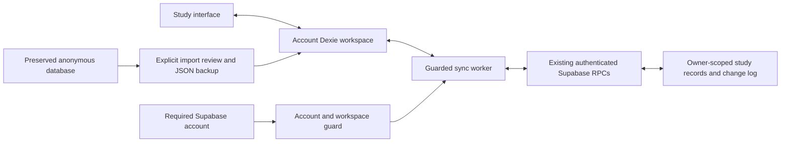

# Phase 5: account synchronization and safe history import

Phase 5 connects each authenticated account's Dexie workspace to the existing Phase 3 Supabase RPCs. Study edits still save to IndexedDB immediately. The worker uploads completed records and incrementally downloads changes into that same local database. Another device signed into the same account receives subjects, completed sessions, their recorded allocations, and shared study preferences.

Authentication remains required. There is no guest entry, automatic anonymous-history import, Realtime subscription, direct cloud UI store, new backend, or hosted database migration in this phase. The existing Phase 3 SQL file is unchanged. This report describes the Phase 5 source; a deployed website or packaged release may still contain an earlier phase until this PR is reviewed and released.

## Architecture and ownership



The authenticated Supabase UUID selects `stride-account-<UUID>`. Every worker is bound to one database, workspace generation, and authenticated account. The RPC adapter checks the official client's current session and freezes that account's bearer authorization on each request. User tokens, passwords, secret keys, and owner IDs never enter the operation payload or sync sidecars. The server derives ownership from `auth.uid()`; its RLS, grants, private schema, and RPC architecture remain unchanged.

Web Locks serialize sync, import, and conflict-resolution work across windows using the same account database. An account or lifecycle change aborts requests, cancels queued lock waits, and causes the final guard inside Dexie transactions to roll back. A late acknowledgment cannot write into a different account's cache. A browser without Web Locks keeps local study available and reports a synchronization limitation instead of running competing workers.

The anonymous `stride` database and its legacy localStorage source remain separate. Phase 5 reads them to detect and offer explicit recovery; it never claims them for an account, automatically uploads them, or deletes the source.

## Payload boundary and analytics

`normalization.ts` validates domain records before dispatch and validates downloaded records before a page can commit. Explicit timestamps are canonicalized to ISO UTC instants. Offset-less legacy timestamps use the same device-local interpretation as the previous application and are frozen before dispatch. Equality compares these normalized instants and sorted slices, so differing timezone spellings do not produce false divergence.

Session payloads remain `{session, slices}`. Allocation `day` keys are copied exactly; they are never regenerated from the server timezone or normalized timestamps. Session records and their full allocation arrays commit together. Remote records then use the existing history, heatmap, streak, insight, and archive calculations in IndexedDB.

Only `{minimum, goal, presets, weekStart}` is shared. Locally valid numeric preset strings are canonicalized before sending. Theme, notification permission/preferences, onboarding, active timers, recovery data, and account-session state stay on the device. Receiving or resolving shared preferences preserves device-only settings. PostgreSQL revisions and cursors stay decimal strings, including values above JavaScript's safe integer range.

## Initial reconciliation

Each run first finishes an incremental pull before dispatching new local changes. This establishes the cloud side before an existing account cache is linked or a staged import is committed.

| Local account cache      | Cloud account | Behavior                                                                              |
| ------------------------ | ------------- | ------------------------------------------------------------------------------------- |
| Empty                    | Empty         | Normal first use; later local edits enter the outbox.                                 |
| Populated                | Empty         | Existing unlinked records are queued after the first complete pull.                   |
| Empty                    | Populated     | Cloud subjects, sessions, allocations, and shared preferences populate Dexie.         |
| Populated                | Populated     | Equal IDs and normalized contents link safely; divergent versions become conflicts.   |
| Legacy anonymous history | Either state  | The user explicitly stages, backs up, and imports history after cloud reconciliation. |

`bootstrap.ts` links old account caches only once, without changing IDs, allocation days, or device settings. Existing revisions, outbox entries, and conflicts prevent duplicate seeding. Dexie remains at version 2; the Phase 1 stores, Phase 2 sidecars, and their keys are unchanged. Optional receipt, deletion, and conflict-context fields require no IndexedDB schema rewrite.

## Pushes, immutable requests, and coalescing

`push.ts` reads the outbox in sequence order. It blocks conflicting entities and orders parent creation before dependent session upserts. Child deletions are handled before parent deletion where possible. Unrelated safe entities can progress while another entity needs review.

Before dispatch, a Dexie transaction stores the normalized `wire_request` and marks the operation `in_flight`. That frozen request includes its stable UUID, action, payload, identity, and original expected revision. A timeout, crash, lost acknowledgment, or sign-out after dispatch leaves the same request available for retry. The server's operation receipt deduplicates that identical UUID and contents.

Applied acknowledgments update `recordRevisions` and remove the operation in one transaction. They rebase only never-submitted successors of the same record, preserving later local edits. Revisions cannot regress when an old durable receipt arrives after a newer pull. An acknowledgment cursor does not advance the pull cursor; earlier cloud changes may still be unseen.

The exact coalescing rules are:

- An unchanged save adds nothing.
- A never-submitted `pending` edit for the same entity and ID may take the newest action and payload. Its UUID and original base revision stay intact.
- `in_flight` or frozen requests never change. A later local edit receives a new pending operation and UUID.
- A completed session and all its slices form one operation; unrelated records never coalesce.
- Shared preference changes queue; device-only preference changes do not.
- Creates followed by deletes are retained conservatively. This phase does not cancel create/delete pairs based on an assumption that the server never saw them.
- A conflict-resolution write receives a new UUID at the current cloud revision. Rejected, superseded versions remain recoverable.

A definitive SQL validation/foreign-key rollback can be replaced only through an explicit resolution after preserving its frozen request. Unknown network, timeout, authentication, or malformed-response outcomes must settle the original receipt first; they cannot be assumed not to have committed.

## Incremental pulls and cursor safety

`pull.ts` calls `get_sync_changes` with the account's `study` cursor and a bounded page size of 100. It validates decimal strings, contiguous sequence order, payload identity, page bounds, and cursor progress. Each page's records, allocations, conflicts, revision metadata, recovery copies, and cursor commit in the same Dexie transaction.

A crash or injected failure before commit leaves the previous cursor and records intact; restarting replays that page. A cursor is advanced only after all its changes have been processed. Normal tombstones delete the corresponding local record and its allocations explicitly; absence from a snapshot never implies deletion.

Each pull pass processes at most 20 pages, and each push batch sends at most 100 operations. A run pulls before its push batch and again afterward; more work is scheduled in bounded follow-up runs. A pull echo can recognize a committed local operation and protect a newer successor, but an interrupted `in_flight` request still settles its original UUID receipt. The worker does not scan or download the complete cloud history on every run.

## Conflicts and parent-deletion races

Pending local changes are protected from silent remote overwrite. A disagreement captures both action/payload versions, the entity and ID, base/current revisions, deletion state, and recoverable context. Repeated pulls update the latest cloud choice without losing earlier copies. Old receipt snapshots cannot replace a newer pulled version.

Settings show two versions with these choices:

- **Keep this device's version** creates a fresh conditional operation.
- **Use cloud version** applies the captured cloud version only after the user's choice.
- **Keep both**, for two live subjects or sessions, clones one branch to new UUIDs and preserves the cloud branch at its original ID. Subject/session references and all allocation IDs are remapped together. Singleton preferences cannot be duplicated.

Import conflicts instead say **Keep account version**, **Import this version**, and **Keep both**. A divergent imported subject includes its staged session/timer tree, so the interface explains the scope of that branch before the choice. Cloud-cascade resolution does not silently resolve separate staged-import conflicts.

Parent and child dependencies are protected even after a local parent deletion has removed the child rows: the pre-deletion recovery tree retains their relationships. A remote child edit can block a pending parent delete; a remote parent delete conflicts with pending child work or a device-local timer. Choosing a cloud deletion preserves an active timer under a new recoverable subject; the timer state itself is never uploaded.

A session moved to another subject after a conflict was captured is outside the original parent's resolution scope. Parent choices preserve that session's current allocations and unsent queue, and leave its separate conflict for its own explicit choice. Keeping both does not duplicate the moved session from an older recovery tree. A proven rejected old-parent request can be saved and replaced with a fresh UUID for the latest moved or deleted version; unknown submitted outcomes still require receipt confirmation first.

The server conditions a subject deletion on the subject revision, not every child revision. Another device can create a child between the deleting device's preflight pull and its delete RPC. The existing ordered, unpruned change log preserves that child's live upsert before the cascade tombstone. The client retains the live child as a selectable recovered version, alongside the cloud deletion, and can restore its subject and exact allocations using the current tombstone revisions. The SQL-backed browser test exercises this ordering through the actual Phase 3 SQL and confirms restoration. No server change is needed while the full feed remains available.

**Do not prune change history or operation receipts.** Retention/compaction needs a separate protocol for stale devices and recovery before it could preserve this safety property.

## Legacy and JSON history imports

After sign-in, legacy history prompts **Existing study history found on this device** with **Import into my account** and **Keep it stored for later**. Deferring is account-specific, keeps the original database intact, and leaves an import action in Settings. Signing into another account does not reuse that account's handled/deferred decision.

The explicit import process is:

1. Validate and save an immutable staged source plus recovery copy before changing study records.
2. Offer a version-1 JSON backup download; the import button remains disabled until the backup is saved.
3. Finish a successful cloud reconciliation before committing the stage.
4. Import subjects before sessions in one Dexie transaction. Preserve IDs where safe; deduplicate only identical ID and normalized contents, never subject names.
5. Capture same-ID divergence or known tombstones as conflicts. Defer a divergent subject's whole incoming child tree for an explicit branch choice.
6. Store the completion/result marker in the same transaction as records and outbox entries.

Canceling the review leaves staged data and its backup intact, with no imported study records or uploads. The stage can resume after reload. Explicitly selecting another backup changes only the review pointer; the previous source remains in its recovery copy. A stale stage ID cannot accidentally commit the replacement. Repeating a completed stage does not duplicate histories.

The anonymous source is never deleted. Legacy active work remains in that source and the staged backup; where the chosen parent exists and there is no current account timer, it also restores as a paused local timer. An existing timer is never replaced. A kept-both imported subject correctly remaps its paused timer to the new subject.

Signed-in **Import JSON** now uses the same additive reconciliation process. It does not treat choosing a file as permission to replace local or cloud history. Unrelated account records are preserved. Existing supported version-1 exports remain readable, and exports still include subjects, sessions, allocations, settings, and active timer recovery. JSON import remains disabled while the current account has an active timer; staged legacy recovery also preserves any existing timer.

## Ongoing sync, offline use, and errors

Sync starts after authenticated workspace restoration. Triggers are local outbox changes, reconnect, foreground, manual **Sync now**, and one low-frequency check per minute while visible. Simultaneous triggers coalesce. There is no Realtime subscription or aggressive polling.

The account indicator and Settings show **Synced**, **Syncing…**, pending counts, **Offline**, conflicts, account/sync errors, or **Never synced**, plus last-success and retry times where useful. Local study mutations remain immediate while cloud access is unavailable. Required authentication is unchanged: a signed-out device still cannot enter, and restoration/refresh still follows the official SDK's existing rules. The web app has no offline application-shell cache, so an offline reload also depends on its files being available.

Transient network/timeouts/5xx/429 failures use exponential backoff with jitter, capped at five minutes for the normal delay. `Retry-After` can require a longer wait and cannot be bypassed by manual sync. Auth failures pause safely and request account attention. Invalid local operations, permanent validation errors, and malformed RPC responses are preserved and quarantined rather than retried indefinitely. Manual retry is available; there is no general corrupted-record repair editor in Phase 5.

Error messages are sanitized. The request wrapper captures only a public retry delay, never authorization headers or raw credentials. Hosted test credentials, if used, belong only in the restricted test process and are not committed or embedded in the app.

## Changed files

| Area                          | Files and responsibility                                                                                                                                                                                                                                                                                   |
| ----------------------------- | ---------------------------------------------------------------------------------------------------------------------------------------------------------------------------------------------------------------------------------------------------------------------------------------------------------- |
| Protocol adapter              | `src/lib/sync/types.ts`, `src/lib/sync/normalization.ts`, `src/lib/sync/client.ts`, `src/lib/sync/push.ts`, `src/lib/sync/pull.ts`: typed RPC boundary, frozen requests, revisions, pagination, and atomic pages.                                                                                          |
| Lifecycle and reconciliation  | `src/lib/sync/bootstrap.ts`, `src/lib/sync/worker.ts`, `src/sync/SyncProvider.tsx`: initial account linking, account guards, locks, bounded triggers, retries, status.                                                                                                                                     |
| Preservation and imports      | `src/lib/sync/conflicts.ts`, `src/lib/sync/import.ts`: version/recovery preservation, explicit choices, complete branch remapping, staged legacy/JSON reconciliation.                                                                                                                                      |
| Local database/client         | `src/lib/local-database.ts`, `src/lib/supabase.ts`: exported transactional queue helper, frozen-request/deletion/context fields, deletion recovery, shared-only preferences, retry-aware fetch.                                                                                                            |
| UI                            | `src/components/HistoryImport.tsx`, `src/components/SyncPanel.tsx`, `src/components/AccountPanel.tsx`, `src/components/AuthenticationScreen.tsx`, `src/pages/Settings.tsx`, `src/App.tsx`, `src/main.tsx`, `src/workspace.css`: worker mounting, status, explicit history/backup review, conflict choices. |
| Unit tests                    | `src/lib/sync/import-conflicts.test.ts`, `src/lib/sync/sync-protocol.test.ts`, `src/lib/sync/worker.test.ts`: import/resolution, RPC/cursor/retry behavior, account cancellation, lifecycle scheduling.                                                                                                    |
| SQL-backed browser tests      | `tests/sync-fixture.ts`, `tests/sync-e2e/multi-device.spec.ts`, `playwright.sync.config.ts`: independent browser contexts with intercepted Auth/RPC requests backed by the actual migration in PGlite.                                                                                                     |
| Existing fixtures/regressions | `tests/auth-mock.ts`, `tests/auth-e2e/auth.spec.ts`, `tests/e2e/persistence.spec.ts`: existing auth/persistence tests accommodate the explicit sync boundary.                                                                                                                                              |
| Real local integration and CI | `supabase/tests/client-integration.test.ts`, `vitest.integration.config.ts`, `scripts/run-local-integration.mjs`, `package.json`, `.github/workflows/check.yml`, `.github/workflows/supabase-integration.yml`: actual SDK/Dexie/Auth/PostgREST gates against a disposable local stack.                     |
| Documentation                 | `README.md`, `docs/PHASE_5_SYNC.md`, `docs/PHASE_2_SYNC_FOUNDATION.md`, `docs/PHASE_3_SUPABASE.md`, `docs/PHASE_4_AUTH.md`, `docs/PHASE_4_1_AUTH_REQUIRED.md`: current guide/report and historical supersession notes.                                                                                     |
| Screenshots                   | `docs/screenshots/phase5-legacy-import.png`, `docs/screenshots/phase5-sync-settings.png`, `docs/screenshots/phase5-sync-conflict.png`, `docs/screenshots/phase5-sync-narrow.png`: explicit import and desktop/focused/narrow conflict review using isolated fixtures.                                      |

The implementation inventory above contains 45 added or modified files, including four screenshots. The Phase 3 migration, Tauri CSP/capabilities, application domain record shapes, and existing analytics implementation are unchanged. Hosted test provisioning used an ignored test harness; credentials and that provisioning harness are not client or release artifacts.

[Desktop synchronization and conflict review](screenshots/phase5-sync-settings.png) · [Focused conflict choices](screenshots/phase5-sync-conflict.png) · [Narrow conflict review](screenshots/phase5-sync-narrow.png) · [Explicit legacy-history import](screenshots/phase5-legacy-import.png).

## Verification and evidence

The baseline from merged `main` was clean and passed 55 unit/auth tests, 13 PostgreSQL contract tests, seven existing browser tests, 14 auth/configuration browser tests, and a production build before implementation. These are baseline results, not final Phase 5 counts.

The final whole-repository unit run passed 143 tests: 55 existing unit/auth cases and 88 sync cases (46 import/conflict, 31 protocol, 11 worker). They include atomic interrupted-import recovery, cancellation/account guards, one thousand sessions/two thousand allocations, branch cloning, paused-timer recovery, definitive SQL-rollback recovery, moved-child resolution boundaries, and the late-cascade resolver.

| Verification layer                                         | Final Phase 5 result                                                                                                                                                                                                                                     |
| ---------------------------------------------------------- | -------------------------------------------------------------------------------------------------------------------------------------------------------------------------------------------------------------------------------------------------------- |
| Unit/auth and sync/import/conflict tests                   | 143/143 passed.                                                                                                                                                                                                                                          |
| PostgreSQL/RLS/RPC contract tests                          | 13/13 passed.                                                                                                                                                                                                                                            |
| Existing browser regression suite                          | 7/7 passed.                                                                                                                                                                                                                                              |
| Auth/configuration browser suite                           | 14/14 passed.                                                                                                                                                                                                                                            |
| SQL-backed multi-device browser suite                      | 15/15 passed; intercepted Auth/PostgREST routes backed by actual Phase 3 SQL in PGlite.                                                                                                                                                                  |
| Real local Supabase Auth/PostgREST plus client integration | Six client cases and the existing raw Auth/PostgREST gate run in the disposable Linux CI stack. The local stack is unavailable on this Windows machine. See [PR #7 checks](https://github.com/NotThatBoii/stride/pull/7/checks) for executed CI results. |
| Hosted Supabase disposable-account verification            | 6/6 real client cases passed; two disposable confirmed Auth users deleted afterward. Details below.                                                                                                                                                      |
| Production build                                           | Passed: strict TypeScript and Vite production build.                                                                                                                                                                                                     |
| Packaged Windows/Tauri build and native sync               | `npm run desktop:build` attempted; failed at `cargo metadata` because Cargo is unavailable. Packaged native sync remains untested.                                                                                                                       |
| Final branch/commit/PR                                     | `codex/phase-5-sync`; implementation commit [6bd6a50](https://github.com/NotThatBoii/stride/commit/6bd6a5088dd90e53b8ef80a7462a13f8ad70d312); [PR #7](https://github.com/NotThatBoii/stride/pull/7), open for review and unmerged.                       |

The SQL-backed browser suite passed 15 cases covering subject transfer; completed-session allocations and analytics across timezones; offline conflicting edits; parent/child tombstones; a committed request with a lost acknowledgment; page rollback and cursor replay; two-account isolation; sign-out during a request; large pagination; explicit non-destructive legacy import; safe backup import; the late parent-cascade race; definitive foreign-key rejection recovery; and both cloud/both parent choices after moving children elsewhere. The latter choices preserve exact child operation objects, allocations, and independent child conflicts through subsequent uploads. Heatmap visibility, daily totals, overall/subject streaks, history/insights visibility, and archive inclusion/exclusion are checked on the receiving device.

Hosted verification used two new disposable, confirmed Auth identities. An admin-only ignored test harness obtained existing CLI credentials in memory solely to create and delete those identities; the client scenarios used the ordinary public Supabase SDK, password sign-in, account-scoped Dexie databases, and authenticated RPCs. Three independent logical devices represented the first account, and another represented the second. Six cases passed: study/session/allocation/shared-preference transfer; an actual committed request with a lost acknowledgment and same-UUID retry; preserved edit conflicts; two-account isolation plus anonymous RPC denial; real parent/child tombstone propagation; and a real foreign-key rollback correctly classified as a definitive rejection without advancing the change feed. Deleting both test users afterward cascaded their study and sync data. No personal study history, hosted SQL, RLS/grants, or Auth settings were changed. Public sign-up email delivery/confirmation was not tested.

Windows headless Edge automation has a separately reproduced limitation when a persistent profile performs a second blob download after browser restart: the browser process closes even with a standalone HTML download button and no Stride code. The persistence regression verifies restart/cache and offline staged/resumable import; regular independent-context JSON download, additive import, and repeated import tests passed. This does not establish native Tauri file-dialog validation.

PGlite tests run the checked-in SQL, but simulate Auth identities and PostgREST routing and use a single SQL connection. They establish client storage/protocol behavior and controlled race ordering, not hosted email delivery or full concurrent Supabase networking. The separate integration runner restricts its URL to plain HTTP loopback, privately obtains local-only keys, creates disposable users, and runs the real Supabase SDK against Auth/PostgREST. An unavailable local stack must be reported as unavailable, not passed. Hosted verification must use disposable identities only and state exactly which real operations executed and whether cleanup succeeded.

Useful commands:

```sh
npm test
npm run test:db
npm run test:e2e
npm run test:e2e:auth
npm run test:e2e:sync
npm run test:integration
npm run build
```

The integration command requires an already running disposable local Supabase stack. It cannot target the hosted project, and neither it nor Phase 5 applies a hosted migration. Avoid `supabase db reset --linked`.

## Remaining limits and Phase 6 handoff

1. Validate a packaged Windows build with the public Supabase configuration, real WebView2/Web Locks, offline session restoration, conflict/timer recovery, native JSON file dialogs, and notifications. Rust/Cargo availability and actual native results must be reported separately.
2. Finish any unexecuted hosted/Auth/confirmation and real local-network gates recorded above. Keep disposable-test scope, credential hygiene, RLS, grants, and cleanup unchanged. Browser Auth interception cannot verify email delivery or hosted Auth settings.
3. Design and approve a cursor/receipt/change-log retention and stale-device recovery protocol before pruning. The late-cascade preservation proof depends on complete ordered history.
4. Add fuller recovery browsing/export and explicit corrupted-operation repair if needed. Current conflict choices and backups preserve data, but hidden recovery copies do not yet have a general undo/history browser.
5. Measure larger histories and multiple concurrent real Supabase clients, monitor Free-tier database/API usage, and bound recovery/log growth only with a proven recovery policy. Do not enable paid infrastructure or Realtime without a demonstrated need and user approval.
6. Consider an installable web app and offline shell caching. Local-first study data is implemented; offline loading of web application files remains a separate capability.

Phase 5 changes the client synchronization and explicit recovery flows only. Any future hosted schema correction, production deployment, release publication, or migration is a separate reviewed action.
